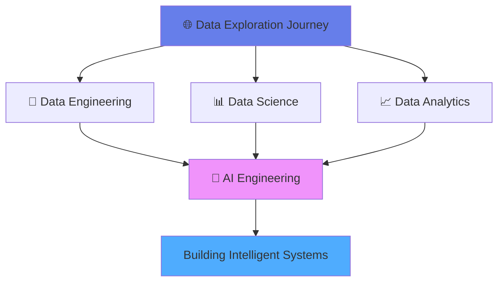

<div align="center">

# 👋 Hi, I'm Yashashree Shinde

### 🎓 MS in Applied Data Intelligence | San José State University
### 🔄 Exploring Data Science → Analytics → Engineering → AI
### 💡 Building the Bridge from Data to Intelligence


[](https://www.linkedin.com/in/yashashree1/)
[](https://github.com/yashashree5)
[](mailto:yashashree.shinde@sjsu.edu)
[](https://raw.githubusercontent.com/yashashree5/yashashree5/main/Yashashree_Resume_DE.pdf)

</div>

---

## 🌟 About Me

> 🔍 **Exploring the Data Universe** - From Data Science to Data Analytics to Data Engineering, with a vision towards AI Engineering

I'm on a journey through the vast field of data, exploring every facet:
- 📊 **Data Science** - Uncovering patterns and building predictive models
- 📈 **Data Analytics** - Transforming data into actionable business insights  
- 🔧 **Data Engineering** - Building robust, scalable data pipelines
- 🤖 **AI Engineering** - My ultimate destination, integrating intelligence into systems
```python
class DataExplorer:
    def __init__(self):
        self.name = "Yashashree Shinde"
        self.current_role = "Data Engineering Focus"
        self.location = "San Jose, CA 📍"
        self.education = "MS in Applied Data Intelligence (2025-2027)"
        self.journey = ["Data Analyst", "Data Scientist", "Data Engineer", "→ AI Engineer"]
        self.mission = "Bridging data engineering with AI to build intelligent systems"
    
    def get_skills(self):
        return {
            "languages": ["Python", "Java", "SQL", "JavaScript"],
            "data_tools": ["Airflow", "dbt", "Spark", "Snowflake"],
            "cloud": ["AWS", "Docker"],
            "databases": ["PostgreSQL", "MySQL", "MongoDB", "Cassandra"],
            "visualization": ["Tableau", "Power BI", "Streamlit", "Plotly"],
            "ai_ml": ["OpenAI APIs", "Snowpark ML", "LightGBM", "Scikit-learn"]
        }
```

<details>
<summary>💼 <b>Professional Journey</b> (Click to expand)</summary>
<br>

- 🏦 **Software Engineer (BA4) @ Barclays**
  - Managed Java-based feed generator lifecycle → **20% efficiency boost**
  - Optimized Spring Boot microservices → **30% stability improvement**
  - Led server migration → **15% reduced downtime**
  - Conducted technical audits and regression testing

- 🎓 **Graduate Student @ SJSU**
  - Focus: Scalable data systems & intelligent automation
  - Building AI-driven data pipelines with modern tools
  - Committed to data storytelling & orchestration

</details>

---

## 🛠️ Tech Stack

<div align="center">

### Languages & Core


### Data Engineering


### Databases


### Cloud & DevOps


### Visualization & Analytics


</div>

---

## 🚀 Featured Projects

<table>
<tr>
<td width="50%">

### 🤖 IncidentIQ
**AI-Powered Incident Management**

- ✨ Built intelligent platform with **OpenAI APIs**
- 📊 Real-time SLA tracking with **Airflow + dbt**
- ⚡ **70% faster** incident resolution
- 🔧 **Tech:** PostgreSQL, Airflow, dbt, Streamlit, Docker

[](https://github.com/yashashree5/IncidentIQ)

</td>
<td width="50%">

### 🍳 SnowChef
**Smart Pantry & Recipe Warehouse**

- 🏗️ Snowflake-based data warehouse
- 🤖 **Snowpark ML** for recommendations
- 📈 Interactive **Tableau dashboards**
- 🔧 **Tech:** Snowflake, Airflow, dbt, Python

[](https://github.com/yashashree5/Snowchef)

</td>
</tr>
<tr>
<td width="50%">

### 💳 Credit Fraud Detection
**Real-time ML Detection System**

- 🎯 LightGBM model for fraud detection
- 🖥️ Interactive Streamlit dashboard
- ⚡ Real-time transaction monitoring
- 🔧 **Tech:** Python, LightGBM, Streamlit

[](https://github.com/yashashree5/Credit_Fraud_Detection_System)

</td>
<td width="50%">

### 🏢 Data Warehouse Projects
**ETL & Dimensional Modeling**

- 📦 Coursework for DATA 226
- 🔄 ETL pipelines & data integration
- 📐 Advanced dimensional modeling
- 🔧 **Tech:** Python, SQL, Data Modeling

[](https://github.com/yashashree5/DATA-226-Data-Warehouse)

</td>
</tr>
</table>

---

## 📊 GitHub Stats

<div align="center">
  


</div>

---

## 🎯 What I'm Currently Working On


**Current Focus:**
- 🔨 Building scalable data pipelines and infrastructure
- 📚 Learning advanced ML Ops and AI system design
- 🌱 Expanding expertise across the full data stack
- 🎯 Integrating AI/ML into data engineering workflows

---

## 💡 Philosophy

<div align="center">

### *"Exploring the full spectrum of data—from analysis to engineering to AI—building intelligent systems where data meets innovation"*

</div>

---

## 📫 Let's Connect!

<div align="center">

I'm always open to interesting conversations and collaboration opportunities!

[](https://www.linkedin.com/in/yashashree1/)
[](mailto:yashashree.shinde@sjsu.edu)


</div>

---

<div align="center">

### ⭐ Fun Fact

*I believe the best data pipelines are like well-choreographed dances—every component knows its role and moves in perfect harmony!* 💃

</div>
